# Лабораторная работа №1 — базовая настройка PostgreSQL на Debian Работу выполнил студент группы ИС-22 Ворончук Даниил

---

## 1. Подготовка среды

### Обновление списков пакетов и обновление системы

```
sudo apt-get update
sudo apt-get upgrade
```

**Разница команд:**
- `apt-get update` — обновляет *списки пакетов* (индексы) из репозиториев.
- `apt-get upgrade` — обновляет *установленные пакеты* до доступных версий (без удаления пакетов и без “сложных” замен зависимостей). 
Команды apt-get update и apt-get upgrade] представлены на рисунке ниже

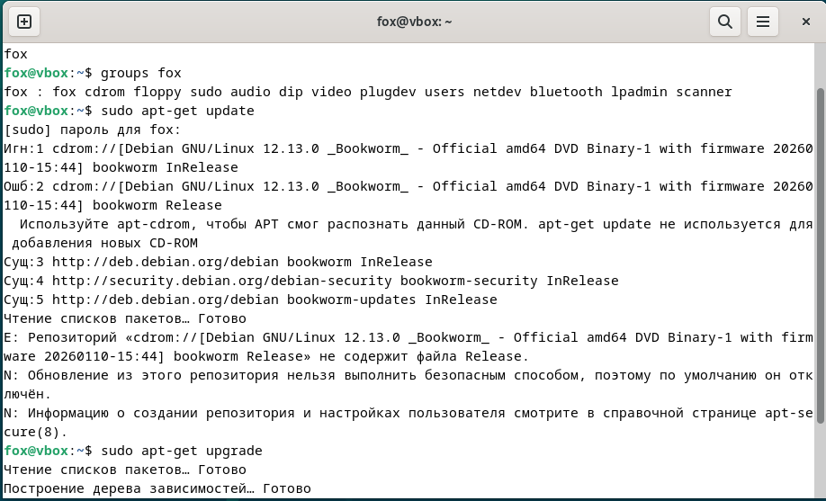
---
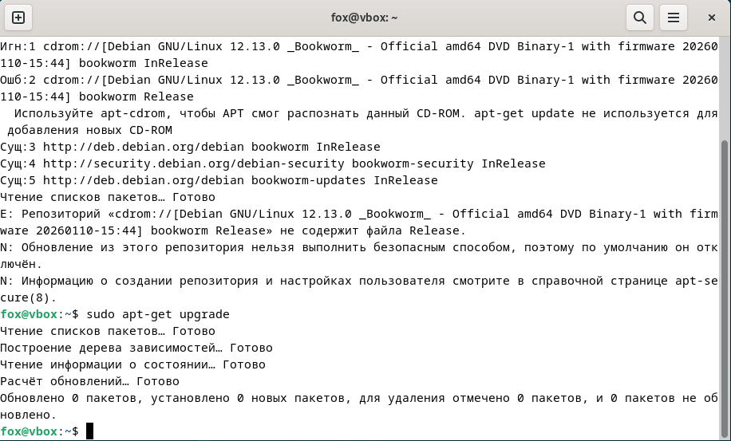
---

## 2. Установка PostgreSQL

Установка PostgreSQL из репозиториев Debian:

```
sudo apt install postgresql postgresql-contrib
```

Проверка версии:

```
psql --version
```

Проверка статуса сервиса:

```
sudo systemctl status postgresql
```


Процесс установки PostgreSQL через apt install] и проверка статуса сервиса PostgreSQL через systemctl status предсталены на рисунках ниже
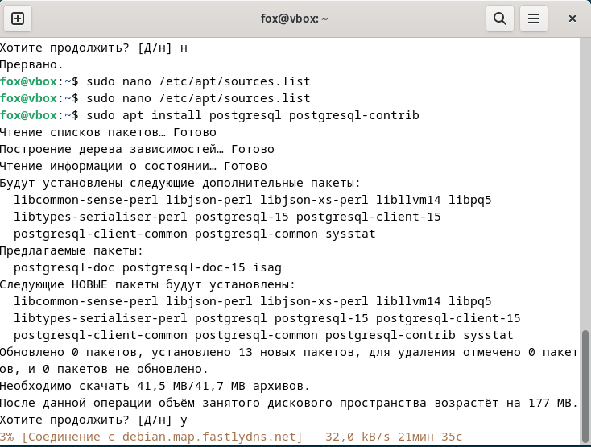
---
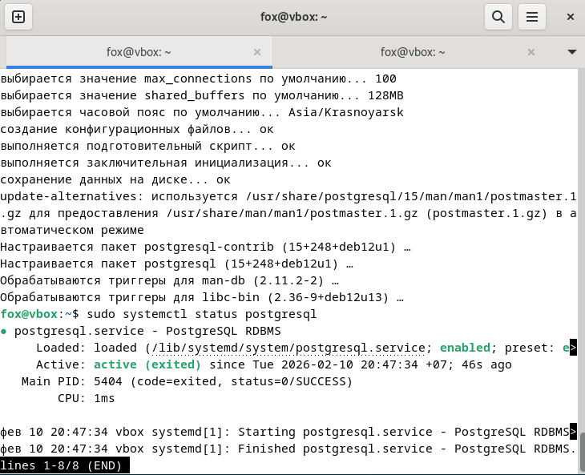

---

## 3. Создание служебной учётной записи `postgres`

При установке PostgreSQL создаётся системная учётная запись **`postgres`**.  
Она используется для запуска процессов сервера и административных действий в СУБД.

Проверка существования пользователя в Linux:

```
getent passwd postgres
```

Подключение к PostgreSQL от имени `postgres`:

```
sudo -u postgres psql
```


 
- Проверка учетной записи пользователя postgres с помощью команды getent 

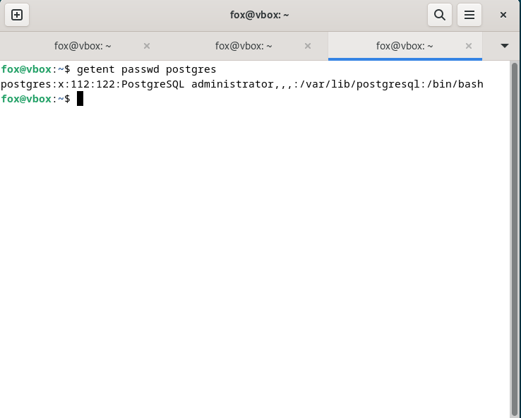

---

## 4 Первичная настройка конфигурационных файлов

Просмотр структуры конфигов:

```
ls -R /etc/postgresql/
```

Основные файлы (для кластера `15/main`):
- `/etc/postgresql/15/main/postgresql.conf` — общие параметры сервера
- `/etc/postgresql/15/main/pg_hba.conf` — правила аутентификации/доступа

- Открытие файла конфигурации PostgreSQL (postgresql.conf) в текстовом редакторе nano команда представлена на рисунке ниже

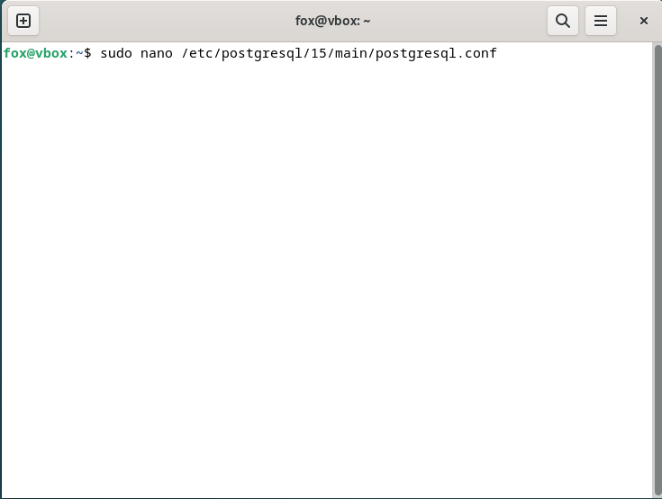


- Изменение порта подключения:
Для настройки сетевого взаимодействия с СУБД был отредактирован конфигурационный файл /etc/postgresql/15/main/postgresql.conf. В секции «Connections and Authentication» параметр port был изменен со значения по умолчанию 5432  на значение 5433.

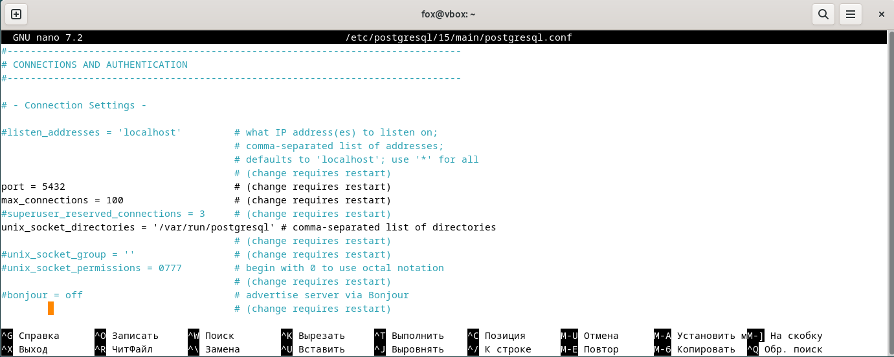
---
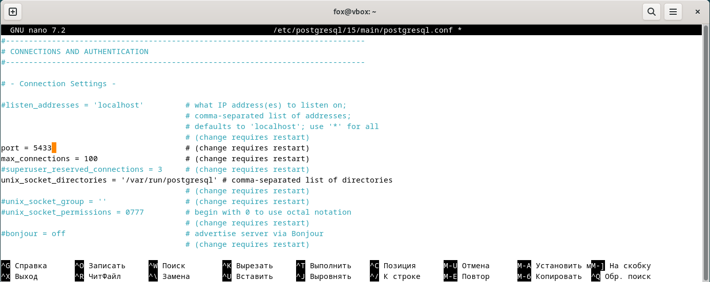


- Перезапуск сервиса:
Для применения изменений конфигурации (смена порта на 5433) был выполнен перезапуск сервиса PostgreSQL с помощью команды sudo systemctl restart postgresql. После перезапуска была проверена статус службы командой sudo systemctl status postgresql, которая подтвердила, что сервер работает успешно (Active: active).
Результат:** кластер `15 main` работает на порту **5433** (статус `online`).

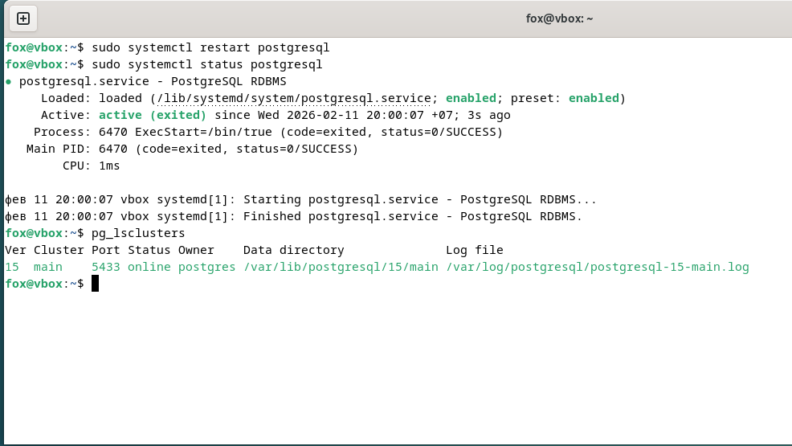

---

## 5. Управление сервисом (systemd)

Проверка статуса:

```
sudo systemctl status postgresql
```

Проверка автозапуска:

```
systemctl is-enabled postgresql
```

**Результат:** `enabled` — сервис запускается автоматически при старте системы.

  
Проверка автозапуска сервиса PostgreSQL представлена на рисунке ниже

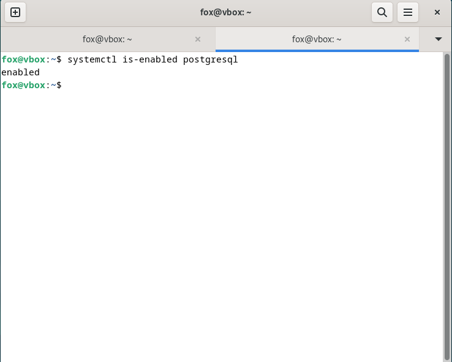


---

## 6. Создание тестовой БД и пользователя

Создание пользователя роли и базы данных:

Вход в psql под `postgres`:

```
sudo -u postgres psql
```

SQL-команды:

```
CREATE ROLE voronchuk WITH LOGIN PASSWORD '1234';
CREATE DATABASE dbvoronchuk OWNER voronchuk;
```

- Создание пользователя voronchuk и базы данных dbvoronchuk представлены на рисунке ниже


Проверка доступа (подключение в psql):

```
psql -h localhost -p 5433 -U voronchuk -d dbvoronchuk
```

Проверочный запрос:

```
SELECT current_user, current_database();
```
- Подключение к базе данных dbvoronchuk под пользователем voronchuk и проверка текущих пользователя и БД представлены на рисунке ниже

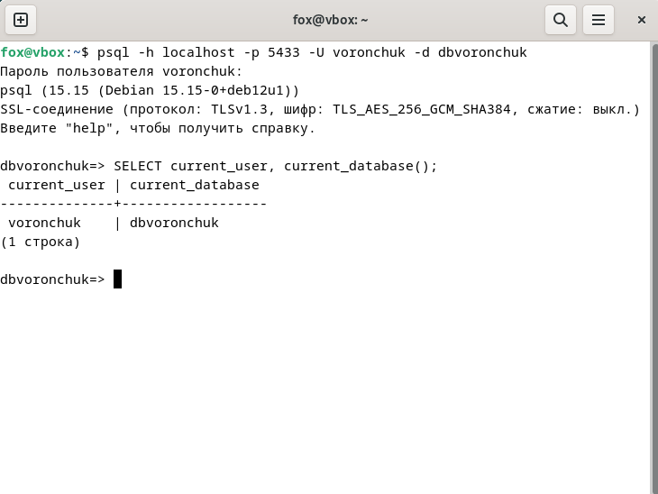
---

## 7. Знакомство со схемами

**Схема (schema)** — это пространство имён внутри *одной базы данных*, в котором находятся таблицы/функции и др. объекты.  
**База данных (database)** — отдельный логический контейнер, к которому выполняется подключение.

По умолчанию есть схема `public`.


```
CREATE SCHEMA test_schema;
\dn
```
Создание схемы test_schema предствлено на рисунке ниже

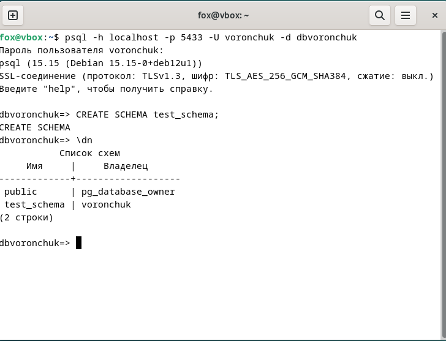


Выдача прав пользователю `voronchuk`:

```
GRANT USAGE ON SCHEMA test_schema TO voronchuk;
GRANT CREATE ON SCHEMA test_schema TO voronchuk;
```
Выдача прав пользователю voronchuk представлена на рисунке ниже

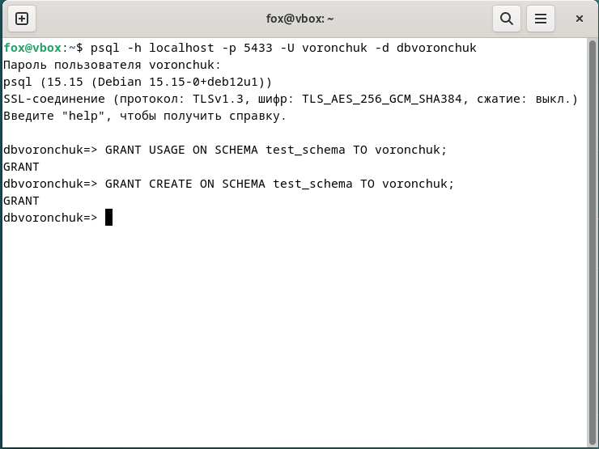


### Демонстрация работы со схемами через `search_path`

```
SHOW search_path;
SET search_path TO test_schema, public;
SHOW search_path;
SET search_path TO public;
SHOW search_path;
```

**Скриншоты:**  

Демонстрация изменения search_path (SHOW/SET) представлена на рисунке ниже

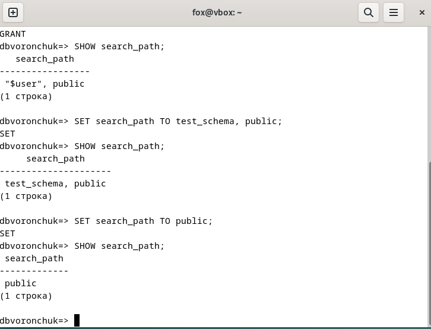
---

## 8. Использование psql для базовых операций

### Таблица в `public` и операции SELECT/INSERT/UPDATE/DELETE

Создание таблицы:

```
CREATE TABLE public.people (
  id SERIAL PRIMARY KEY,
  fullname TEXT NOT NULL,
  age INT
);
```

INSERT:

```
INSERT INTO public.people (fullname, age) VALUES
('Ivan Ivanov', 20),
('Petr Zhukov', 25),
('Anna Gorbachov', 22);
```

SELECT:

```
SELECT * FROM public.people;
```

UPDATE (пример: изменить имя у записи `id = 1`):


UPDATE public.people
SET fullname = 'Sergey Ivanov'
WHERE id = 1;

На рисунке ниже показан процесс создания таблицы people, наполнения её данными, а также демонстрация операции UPDATE (изменение имени у пользователя с id=1) представлена на рисунке ниже

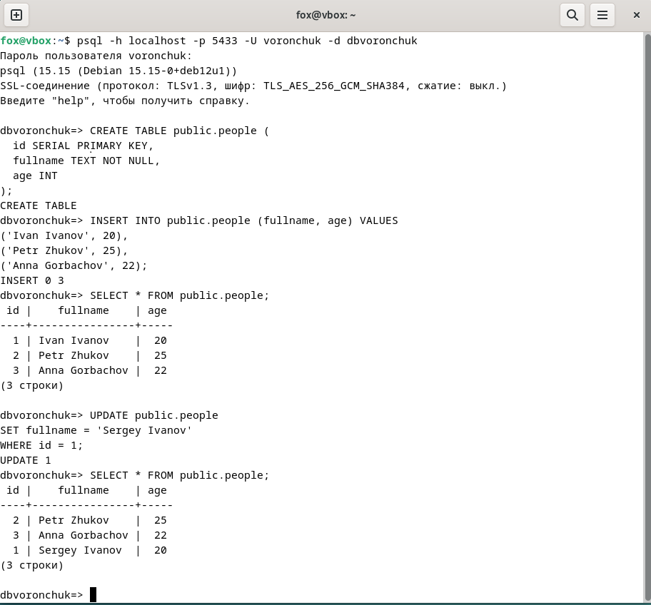


```

DELETE FROM public.people WHERE id = 2;
``` 
Пример выполнения команды DELETE представлен на рисунке ниже


### `test_schema` и обращение к объектам

Создание таблицы и вставка данных:

```
CREATE TABLE test_schema.products (
  id SERIAL PRIMARY KEY,
  name TEXT NOT NULL,
  price INT NOT NULL
);

INSERT INTO test_schema.products (name, price) VALUES
('Keyboard', 30),
('Mouse', 15),
('Monitor', 120);
```

Обращение через имя схемы:

```
SELECT * FROM test_schema.products;
```

- На рисунке ниже продемонстрирована работа с таблицей products, созданной в схеме test_schema, включая вставку тестовых данны

 
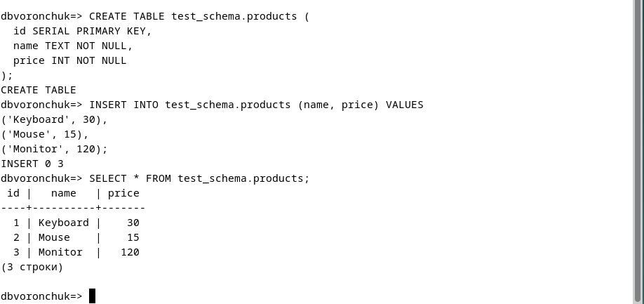

### SQL-скрипт с привязкой к схеме

Создан файл `~/lab1/schema_table.sql`:

```
CREATE TABLE test_schema.orders (
  id SERIAL PRIMARY KEY,
  created_at TIMESTAMP DEFAULT now(),
  comment TEXT
);

INSERT INTO test_schema.orders (comment) VALUES
('First order'),
('Second order');

SELECT * FROM test_schema.orders;
```


Пример скрипта представлен на рисунке ниже

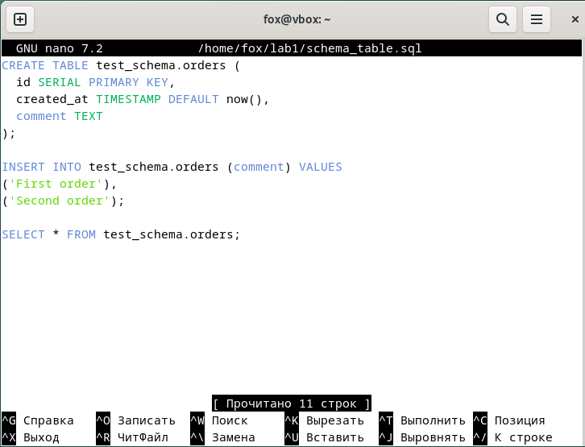

Запуск:


psql -h localhost -p 5433 -U voronchuk -d dbvoronchuk -f ~/lab1/schema_table.sql


Проверка результата:

```
\dt test_schema.*
SELECT * FROM test_schema.orders;
```

  
Запуск SQL-скрипта schema_table.sql через psql -f представлен на рисунке ниже

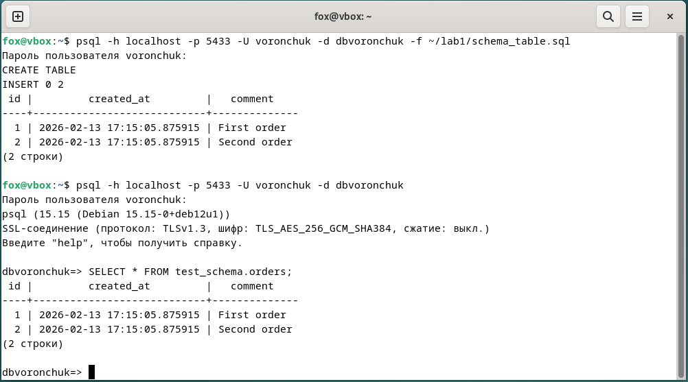

---

## 9. Настройка локальных и сетевых подключений

### Настройка PostgreSQL

В `postgresql.conf`:

```
listen_addresses = '*'
port = 5433
```

Измененый postgresql.conf представлен на рисунке ниже 

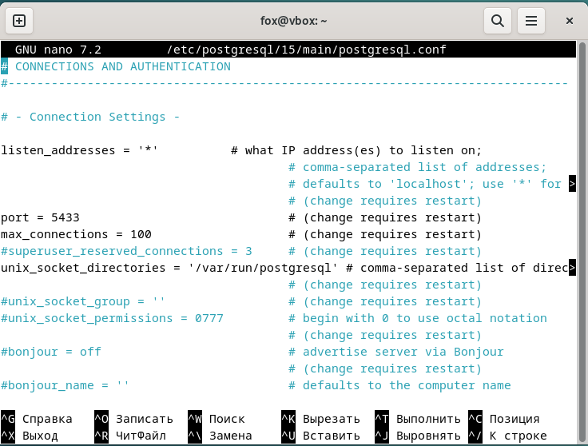

В `pg_hba.conf` добавлено правило (разрешение подключения к базе `dbvoronchuk` пользователю `voronchuk`):

```
host    dbvoronchuk    voronchuk    0.0.0.0/0    scram-sha-256
```

Измененый pg_hba.conf представлен на рисунке ниже 

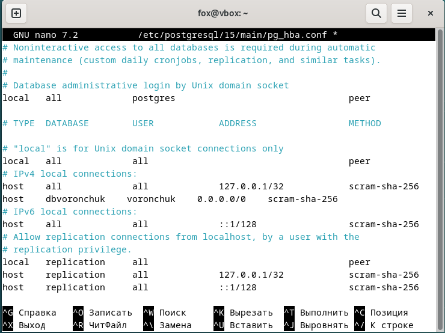

Перезапуск:

```
sudo systemctl restart postgresql
```

Проверка, что сервер слушает на всех интерфейсах:

```
ss -tulnp | grep 5433
```

**Ожидаемый результат:** `0.0.0.0:5433` и `[::]:5433`.

Подключение с локальной машины (Windows)

В DBeaver/pgAdmin:
- Host: `localhost`
- Port: `5433`
- Database: `dbvoronchuk`
- User: `voronchuk`
- Password: `1234`


Пример подключение к базе данных из локальной машины

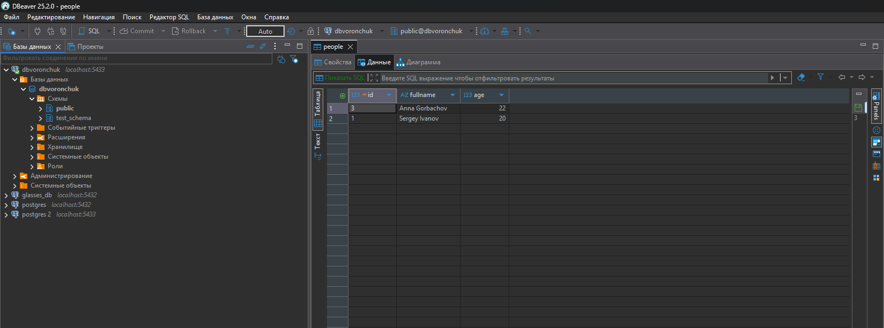

---

## 10. Журналирование (logging)

Параметры в `postgresql.conf` (пример):

```
logging_collector = on
log_destination = 'stderr'
log_connections = on
log_disconnections = on
log_statement = 'all'
log_line_prefix = '%m [%p] %u@%d '
```

После перезапуска PostgreSQL новые логи записываются в каталог:

```
/var/lib/postgresql/15/main/log/
```

Проверка логов:

```
sudo tail -n 50 /var/lib/postgresql/15/main/log/postgresql-2026-02-13_195606.log
```
 
- Просмотр логов PostgreSQL: 

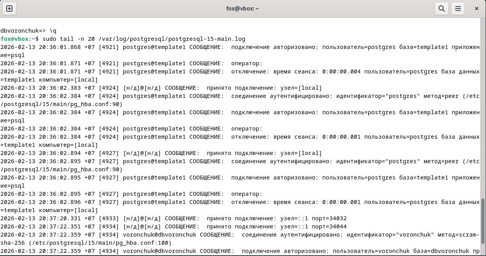

---

11. Назначение ролей и прав
Создание ограниченной роли limited_user

```
CREATE ROLE limited_user WITH LOGIN PASSWORD '1234';
Screenshots/24.png

```
Выдача минимальных прав
```
GRANT CONNECT ON DATABASE dbvoronchuk TO limited_user;
GRANT USAGE ON SCHEMA public TO limited_user;
GRANT SELECT ON TABLE public.people TO limited_user;

```
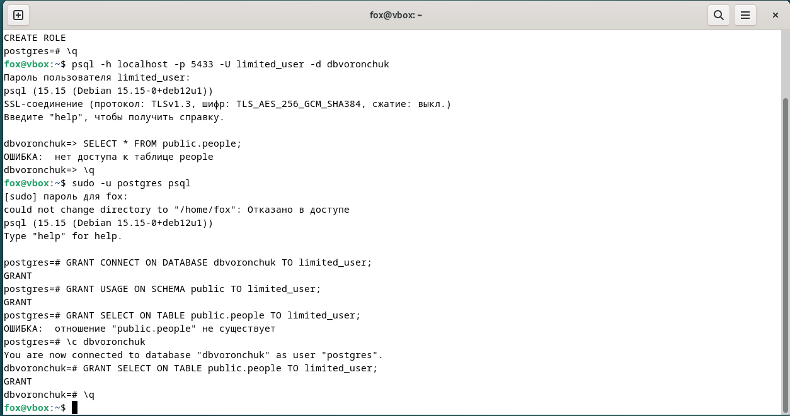

Проверка: попытка изменить данные завершается ошибкой — прав на запись нет.

```
UPDATE public.people SET fullname = 'Sergey Ivanov' WHERE id = 1;
-- ERROR:  permission denied

```

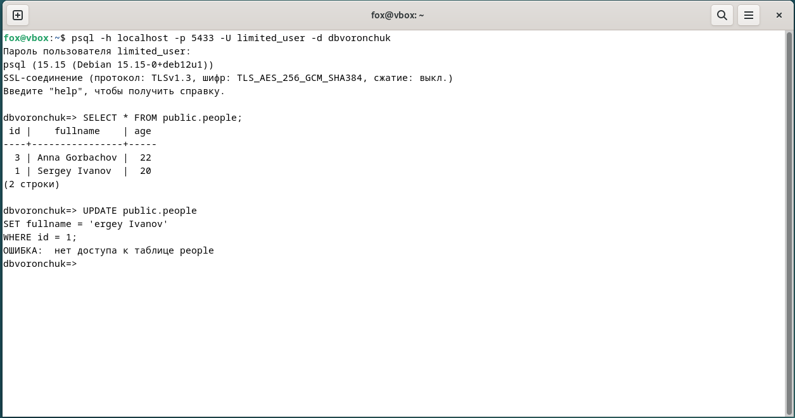

Наследование прав
Создаём групповую роль и выдаём ей права:

```
CREATE ROLE readonly_role NOLOGIN;
GRANT CONNECT ON DATABASE dbvoronchuk TO readonly_role;
GRANT USAGE ON SCHEMA public TO readonly_role;
GRANT SELECT ON TABLE public.people TO readonly_role;
```

Добавляем пользователя в роль и включаем наследование:

```
GRANT readonly_role TO limited_user;
ALTER ROLE limited_user INHERIT;
```

Проверка: limited_user теперь может читать данные через унаследованные права.

```
SELECT * FROM public.people;
```
- 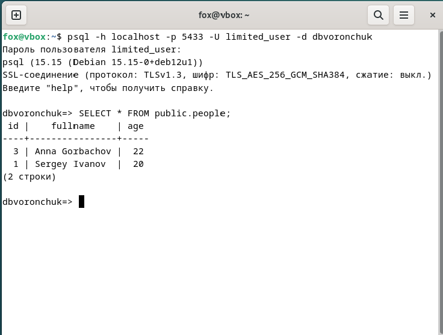

- Создание роли readonly_role, выдача прав на чтение таблицы people  представлены на рисунке ниже
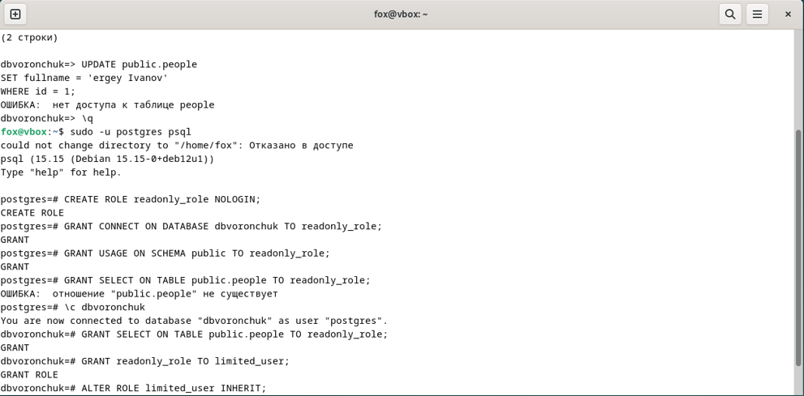

- На рисунке ниже показано подключение к базе данных dbvoronchuk под ограниченным пользователем user_role (включённым в роль-группу readonly_role) и проверка его привилегий: выполнение SELECT из таблицы public.people разрешено, а попытка изменения данных командой UPDATE завершается ошибкой permission denied (прав на запись нет).

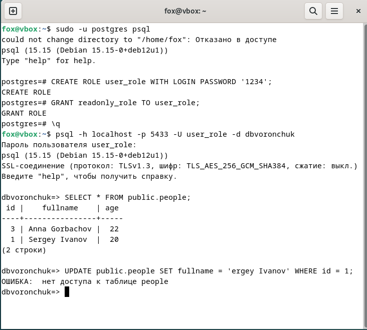


---

## Вывод

В ходе работы:
- установлен и запущен PostgreSQL 15 на Debian 12;
- выполнена первичная настройка (порт 5433, конфиги, управление systemd);
- создан пользователь `voronchuk` и база `dbvoronchuk`;
- изучены схемы, создана `test_schema` и настроены права;
- выполнены базовые операции SQL в `public` и `test_schema`, создан и запущен SQL-скрипт;
- настроен сетевой доступ через VirtualBox NAT + port forwarding;
- включено журналирование и получены примеры строк логов;
- создана ограниченная роль `limited_user`, показаны выдача прав через GRANT и наследование через роль `readonly_role`.
