# Лабораторная работа №2 — резервное копирование, восстановление и мониторинг в Debian и PostgreSQL  
Работу выполнил студент группы **ИС-22** Ворончук Даниил


## 1. Назначение резервного копирования и используемые утилиты

pg_dump и pg_basebackup нужны для разных задач резервного копирования в PostgreSQL: pg_dump делает логическую копию (структура базы, таблицы, данные, функции, права) и удобен, когда нужно сохранить одну базу, отдельные таблицы или схемы, а также при переносе данных между серверами и версиями PostgreSQL, но на больших объёмах он может работать дольше и не копирует сервер целиком; pg_basebackup, наоборот, создаёт физическую копию всего кластера PostgreSQL (то есть всех файлов данных), поэтому его используют для быстрого развёртывания полной копии сервера и создания реплики, однако с его помощью нельзя выборочно сохранить только часть данных, и обычно требуется настроенный доступ с правами на репликацию.

---

## 2. Создание резервной копии базы данных `dbvoronchuk`

- Для создания резервной копии базы данных использовалась утилита pg_dump с двумя различными форматами вывода. На первом этапе был выполнен дамп в пользовательском формате (-Fc), который обеспечивает сжатие данных и гибкость при восстановлении. 

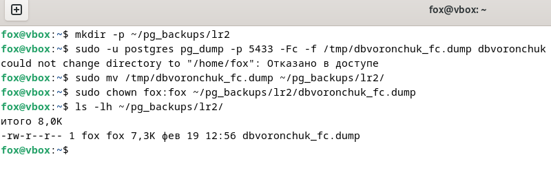

- На втором этапе создан дамп в формате tar (-Ft), представляющий собой обычный архив, совместимый со стандартными tar-утилитами.

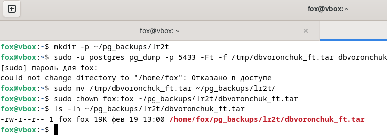

- Основное различие между форматами заключается в функциональности и размере: custom-формат (7,3 КБ) занимает меньше места благодаря сжатию и позволяет выборочное восстановление объектов, тогда как tar-формат (19 КБ) создает несжатый архив, который можно распаковать стандартными средствами ОС, но с ограниченными возможностями при восстановлении БД.

---

## 3. Частичное (выборочное) резервное копирование

Для создания резервной копии только определённой схемы test_schema использовалась утилита pg_dump с ключом -n, который позволяет выполнить дамп указанной схемы без включения остальных объектов базы данных. Дамп создан в пользовательском формате (-Fc) с последующим перемещением в директорию ~/pg_backups/lr2_schema/ и сменой владельца для удобства работы.

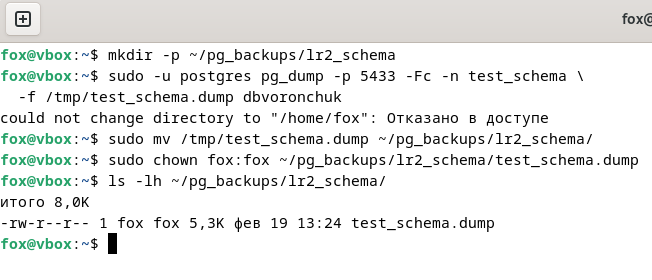

Для создания резервной копии только таблицы people из схемы public использовался ключ -t, ограничивающий дамп одной конкретной таблицей. Аналогично предыдущему шагу, дамп выполнен в формате -Fc и сохранён в директории ~/pg_backups/lr2_tables/.

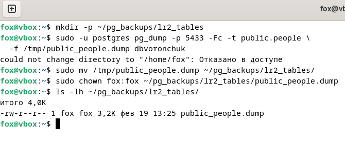

Основное отличие выборочного резервного копирования от создания дампа всей базы данных заключается в объёме сохраняемой информации. Дамп всей базы включает все схемы, таблицы, индексы, функции и другие объекты, тогда как дамп только схемы или отдельных таблиц позволяет сократить объём резервной копии и ускорить процесс восстановления, если требуется сохранить лишь определённые данные. Это особенно удобно при необходимости частого резервирования наиболее важных или часто изменяемых объектов без лишней нагрузки на систему.


---


## 4. Восстановление из резервной копии

- Для восстановления базы данных из резервной копии, созданной в пользовательском формате (-Fc), использовалась утилита pg_restore. Для проверки восстановления из tar-формата аналогично выполнена выборка из таблицы public.people базы dbvoronchuk_restore_tar. Результат запроса подтверждает полное и корректное восстановление данных. Процесс выполнения представлен на рисунке ниже:


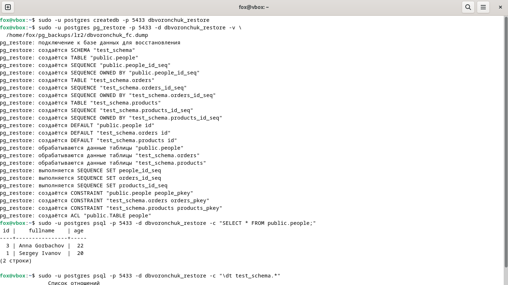


- Для проверки восстановления из tar-формата аналогично выполнена выборка из таблицы public.people базы dbvoronchuk_restore_tar. Результат запроса подтверждает полное и корректное восстановление данных. Процесс выполнения представлен на рисунке ниже:


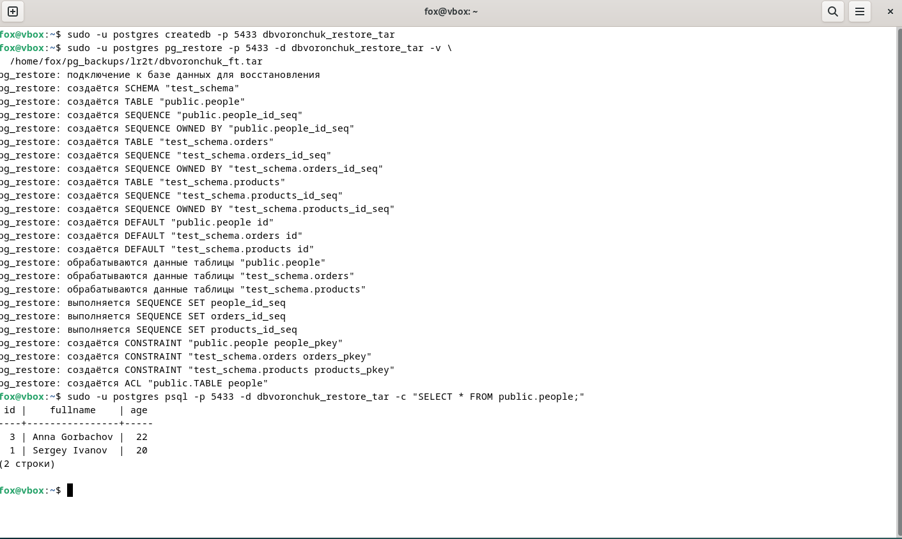

---

## 5. Мониторинг состояния системы (Debian)

- Автоматизация бэкапов с помощью cron
Для обеспечения регулярного резервного копирования базы данных dbvoronchuk была настроена автоматизация с использованием планировщика cron. Создан скрипт автоматического резервного копирования, расположенный по пути /usr/local/bin/pg_backup_dbvoronchuk.sh, который выполняет дамп базы данных в пользовательском формате с временной меткой в имени файла для идентификации даты создания каждой копии.


- На скриншоте ниже представлен процесс редактирования crontab для пользователя postgres. В качестве редактора выбран nano для удобства настройки расписания.

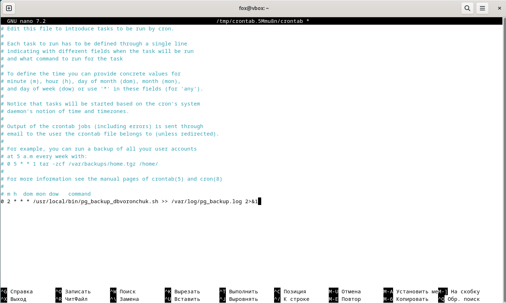

- В файл crontab добавлена следующая запись: 

```
0 2 * * * /usr/local/bin/pg_backup_dbvoronchuk.sh >> /var/log/pg_backup.log 2>&1
```

- Данная запись означает, что скрипт резервного копирования будет запускаться ежедневно в 2:00 ночи. Весь вывод (как стандартный, так и ошибки) перенаправляется в лог-файл /var/log/pg_backup.log для последующего мониторинга выполнения задачи.


- Для хранения резервных копий создана директория /var/backups/postgresql/dbvoronchuk/, в которую сохраняются файлы дампов базы данных. Файлы именуются по шаблону, включающему дату и время создания, например dbvoronchuk_2026-02-19_20-25-19.dump, что позволяет легко определить актуальность каждой копии и упрощает поиск нужного бэкапа. Резервная копия создана в формате CUSTOM (опция pg_dump -Fc).

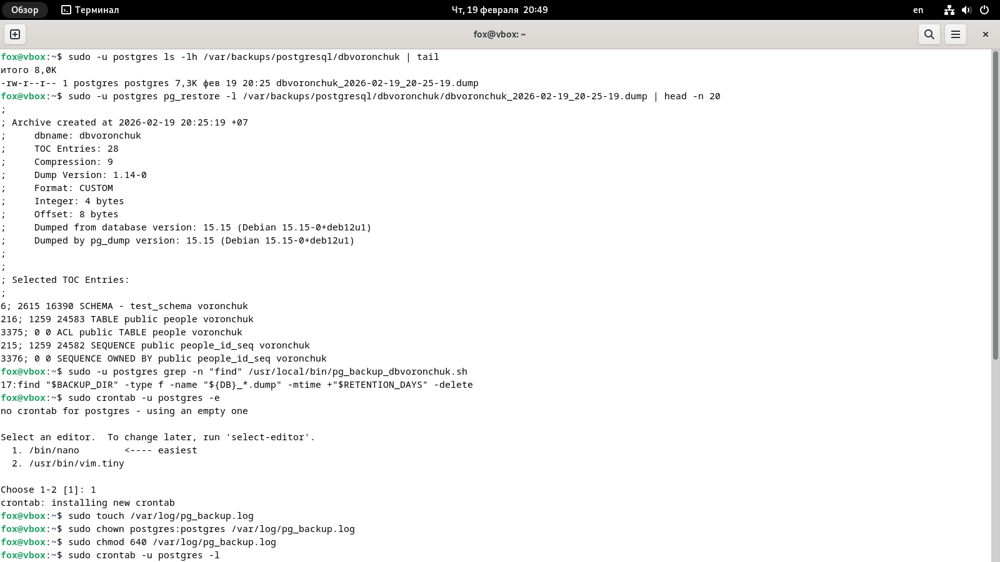


- Ротация резервных копий — это механизм автоматического удаления устаревших файлов дампов для предотвращения переполнения дискового пространства. В представленном скрипте реализована ротация с помощью команды find, которая ищет файлы дампов старше определённого количества дней и удаляет их. На скриншотах видна строка:
```
find "$BACKUP_DIR" -type f -name "${DB}_*.dump" -mtime +"$RETENTION_DAYS" -delete
```
- Параметр -mtime "+$RETENTION_DAYS" указывает находить файлы, которые были изменены более чем RETENTION_DAYS дней назад, после чего они автоматически удаляются. Таким образом, в директории всегда хранятся только актуальные резервные копии за заданный период.

- Для ведения лога выполнения задачи создан файл /var/log/pg_backup.log, которому установлены соответствующие права доступа: владелец postgres:postgres и права 640, что обеспечивает безопасность записей.

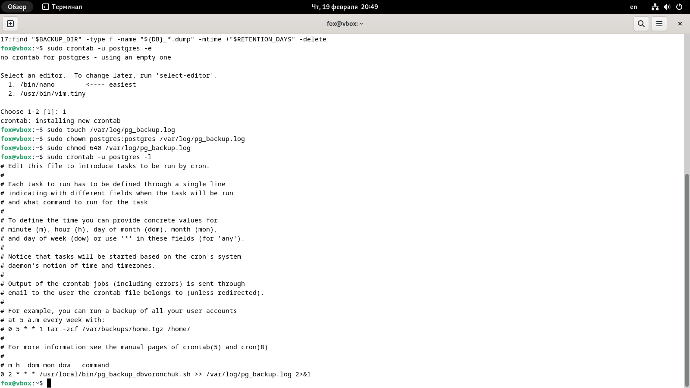

---
## 6. Мониторинг PostgreSQL и завершение запросов

 - Использование top для мониторинга процессов для анализа текущей загрузки системы была использована стандартная утилита top, которая в реальном времени показывает нагрузку CPU, использование оперативной памяти и список активных процессов.

 - На скриншоте  показан вывод команды top, где отображаются показатели нагрузки и процессы, отсортированные по потреблению ресурсов:

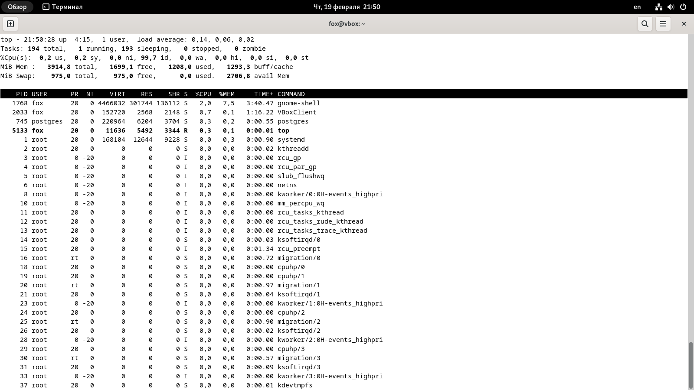

В верхней части окна top отображаются:

- время работы системы (uptime) и load average;

- количество задач (Tasks);

- распределение времени CPU (us, sy, id и т.д.);

- объём занятой/свободной оперативной памяти (Mem) и swap (Swap).

- Это позволяет быстро определить, какие процессы создают наибольшую нагрузку.

Установка и использование htop

- Для более удобного и наглядного мониторинга была установлена утилита htop (расширенная версия top) через apt.

На скриншоте ниже показан процесс установки htop:

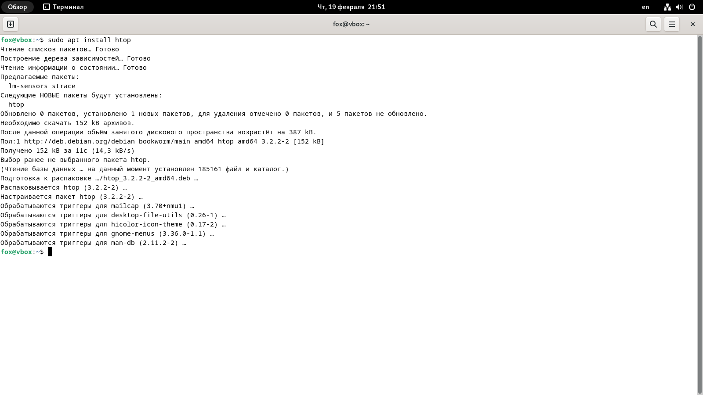


После установки был выполнен запуск htop.

На скриншоте ниже показан интерфейс htop, где наглядно отображаются:

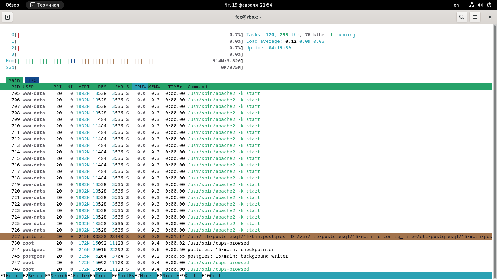

- нагрузка по ядрам CPU;

- использование RAM и swap;

- список процессов (например, apache2, postgres) и их потребление ресурсов;

- удобная сортировка и управление процессами (kill, nice и др.):

- Таким образом, htop даёт более удобный визуальный контроль системы по сравнению с top.

Мониторинг дисковой активности с помощью iotop

- Для диагностики дисковых операций ввода-вывода (I/O) была установлена утилита iotop, которая показывает процессы, активно читающие/пишущие на диск.

- На скриншоте ниже показана установка iotop:

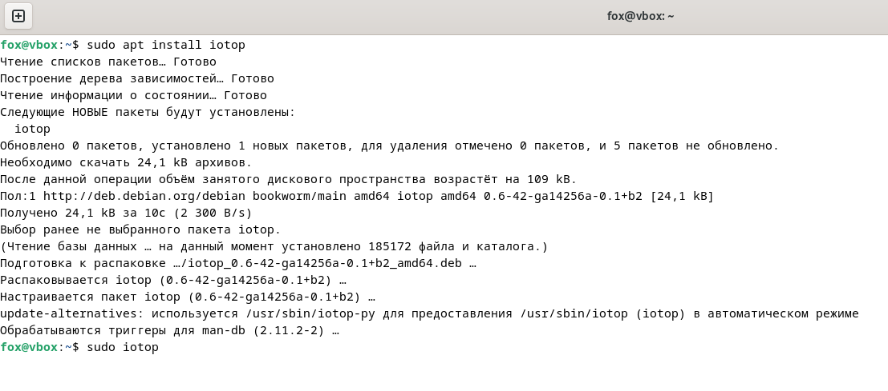

Для корректного отображения статистики утилита запускается с правами администратора.

На скриншоте ниже представлен вывод iotop, где отображаются:

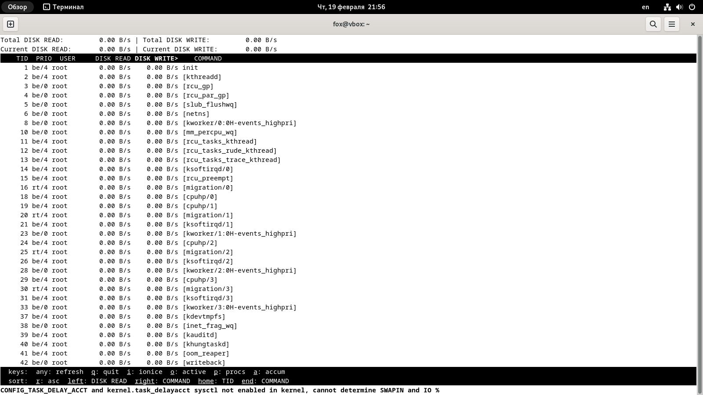

- процессы с активным чтением/записью;

- скорость чтения (READ) и записи (WRITE);

- общая I/O активность системы:

---

## 7. Логирование и анализ логов

- В рамках задания были изучены встроенные статистические представления PostgreSQL, позволяющие анализировать текущую активность сервера базы данных, выявлять долгие запросы и при необходимости принудительно завершать проблемные процессы.

Для мониторинга текущих подключений используется системное представление:

```
SELECT pid, usename, datname, state, query, query_start
FROM pg_stat_activity;
```

На скриншоте ниже показан результат выполнения запроса к pg_stat_activity:

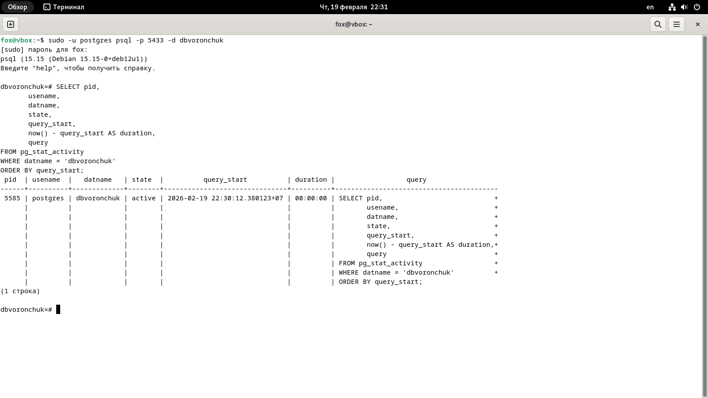

В представлении отображаются:

- pid — идентификатор серверного процесса;

- usename — пользователь, выполнивший подключение;

- datname — имя базы данных;

- state — текущее состояние (active, idle и т.д.);

- query — выполняемый SQL-запрос;

- query_start — время начала выполнения запроса.

С помощью данного представления можно определить, какие запросы выполняются в данный момент и какие подключения находятся в состоянии ожидания.

Поиск долгих (длительно выполняющихся) запросов

- Для выявления «тяжёлых» или зависших запросов используется фильтрация по времени выполнения:

```
SELECT pid,
       now() - query_start AS duration,
       usename,
       query
FROM pg_stat_activity
WHERE state = 'active'
ORDER BY duration DESC;
```

На скриншоте ниже показан вывод запроса с вычислением длительности выполнения:

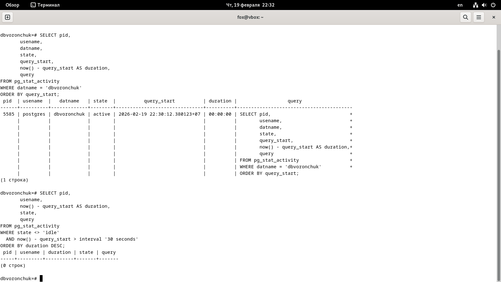

Столбец duration позволяет определить, какие запросы выполняются дольше всего. Это особенно важно при диагностике проблем производительности.

Статистика по базам данных — pg_stat_database

Для анализа общей статистики работы конкретной базы данных используется представление:

```
SELECT datname,
       numbackends,
       xact_commit,
       xact_rollback,
       blks_read,
       blks_hit
FROM pg_stat_database;
```

На скриншоте представлен результат запроса к pg_stat_database:


- numbackends — количество активных подключений;

- xact_commit — число успешно завершённых транзакций;

- xact_rollback — число откатов транзакций;

- blks_read — количество блоков, прочитанных с диска;

- blks_hit — количество обращений к кэшу.

Эти данные позволяют оценить нагрузку на БД и эффективность работы буферного кэша.

- Принудительное завершение зависшего процесса

- Если обнаружен зависший или слишком ресурсоёмкий запрос, суперпользователь PostgreSQL может завершить его с помощью функции:

```
SELECT pg_terminate_backend(<pid>);
```

где <pid> — идентификатор процесса, полученный из pg_stat_activity.

На скриншоте ниже показано выполнение команды завершения процесса:

После выполнения pg_terminate_backend соответствующее подключение разрывается, а выполняемый запрос прекращается.

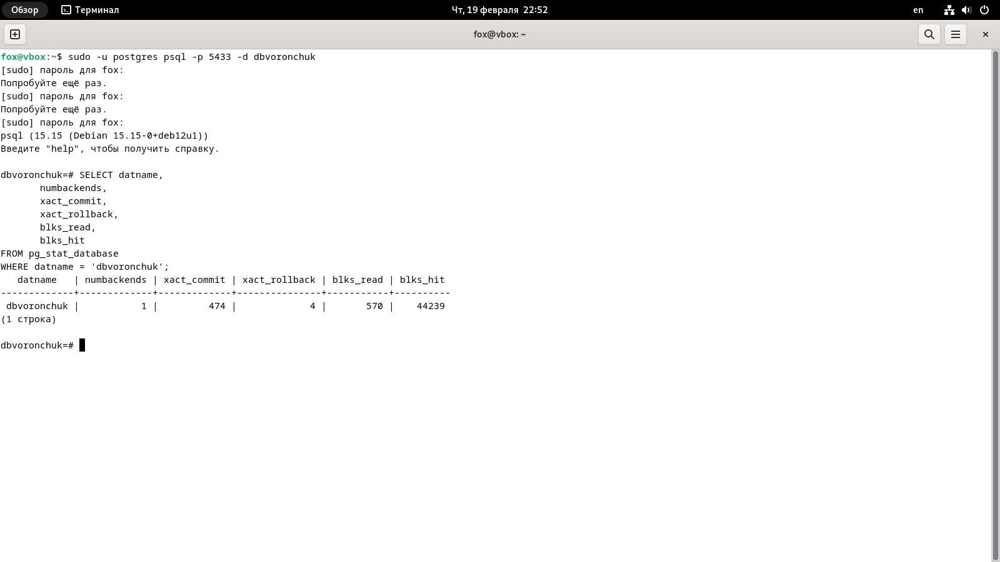

завершение зависших или долгих запросов 

На скриншоте ниже показано показан запуск тестового длительного запроса:

```
SELECT pg_sleep(60);
```

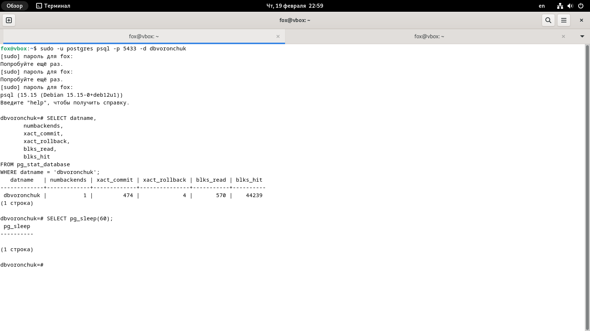

Просмотр активных процессов

Для анализа текущих процессов выполнен запрос:

```
SELECT pid, state, query
FROM pg_stat_activity;
```

- На скриншоте Screenshots/23.png представлен результат выполнения запроса к pg_stat_activity:

В выводе видно:

- процесс со статусом active, выполняющий SELECT pg_sleep(60);;

- текущий активный запрос просмотра статистики;

- другие фоновые процессы PostgreSQL.

Таким образом, представление pg_stat_activity позволяет определить:

- идентификатор процесса (pid);

- его состояние (state);

- текст выполняемого запроса (query).

Принудительное завершение зависшего запроса

Для остановки длительного запроса использована функция:

```
SELECT pg_cancel_backend(5707);
```
На скриншоте ниже видно, что функция вернула значение t (true), что означает успешную отмену запроса.

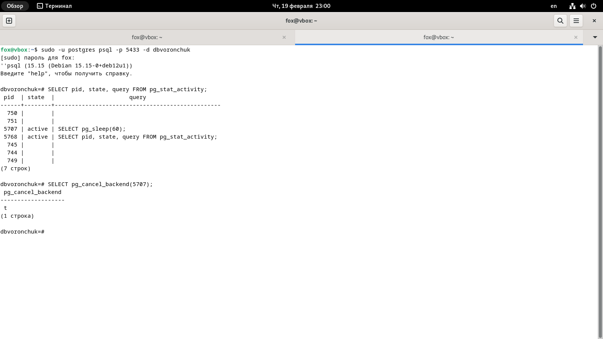

## 8. Логирование и анализ логов 

Просмотр логов PostgreSQL

Логи PostgreSQL в Debian по умолчанию располагаются в директории:

```
/var/log/postgresql/
```

Для просмотра содержимого каталога была выполнена команда:

```
ls -lh /var/log/postgresql/
```

Затем выполнен просмотр последних строк основного лог-файла:

```
sudo tail -n 30 /var/log/postgresql/postgresql-15-main.log
```

- На скриншоте ниже показано содержимое каталога логов PostgreSQL и вывод команды tail:

Из логов видно, что PostgreSQL фиксирует следующие события:

- подключение клиента к серверу (принято подключение);

- успешную аутентификацию пользователя (соединение аутентифицировано);

- авторизацию пользователя к базе данных;

- выполнение SQL-запросов (например, SELECT datname ..., SELECT pg_sleep(60););

- выполнение административных функций (pg_cancel_backend(5707));

- завершение сеанса пользователя (отключение: время сеанса ...).

Просмотр системных логов Debian

```
/var/log/
```

Основные файлы системных логов:

/var/log/syslog

/var/log/daemon.log

Просмотр выполняется командами:

```
sudo tail -n 30 /var/log/syslog
sudo tail -n 30 /var/log/daemon.log
```

В этих файлах фиксируются события операционной системы:

- запуск и остановка служб (systemd);

- сообщения ядра и драйверов;

- системные ошибки;

- события сетевых интерфейсов;

- работа демонов (cron, sshd, networking и др.).


