# Лабораторная работа №3: Расширенные возможности и оптимизация PostgreSQL

---

## 1. Оптимизация конфигурации PostgreSQL

 В файле конфигурации postgresql.conf были изменены следующие параметры, влияющие на производительность:

- shared_buffers — определяет объём разделяемой памяти, используемой PostgreSQL для кэширования данных. Этот параметр является одним из наиболее важных для производительности. Рекомендуемое значение составляет 15–25% от общего объёма оперативной памяти сервера. Изменение параметра shared_buffers представлено на рисунке ниже

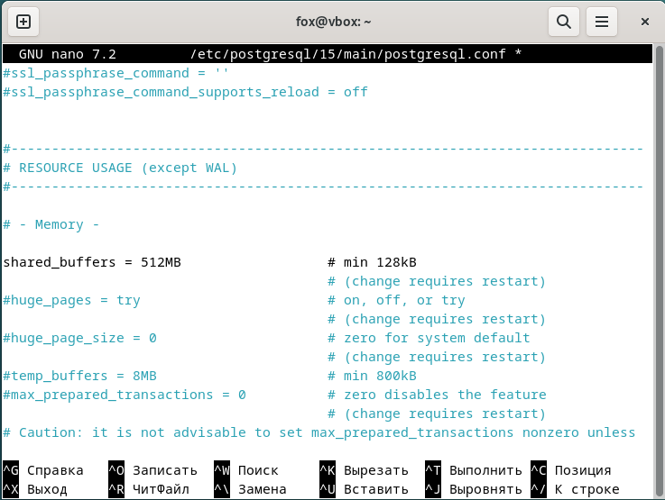

- work_mem — задаёт объём памяти, выделяемый для операций сортировки, хеш-таблиц и соединений в рамках одного запроса. Увеличение этого параметра ускоряет сложные запросы, но при большом количестве одновременных подключений может привести к исчерпанию памяти. Изменение параметра work_mem представлен на рисунке ниже

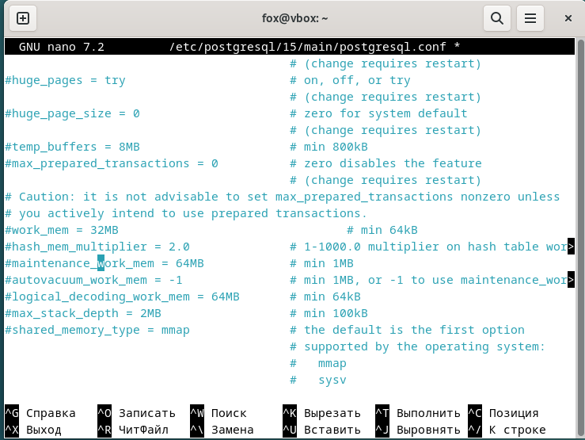

- maintenance_work_mem — определяет объём памяти для операций обслуживания (VACUUM, CREATE INDEX, ALTER TABLE и др.). Более высокое значение позволяет ускорить выполнение этих операций, особенно на больших таблицах. Изменение параметра maintenance_work_mem представлен на рисунке ниже

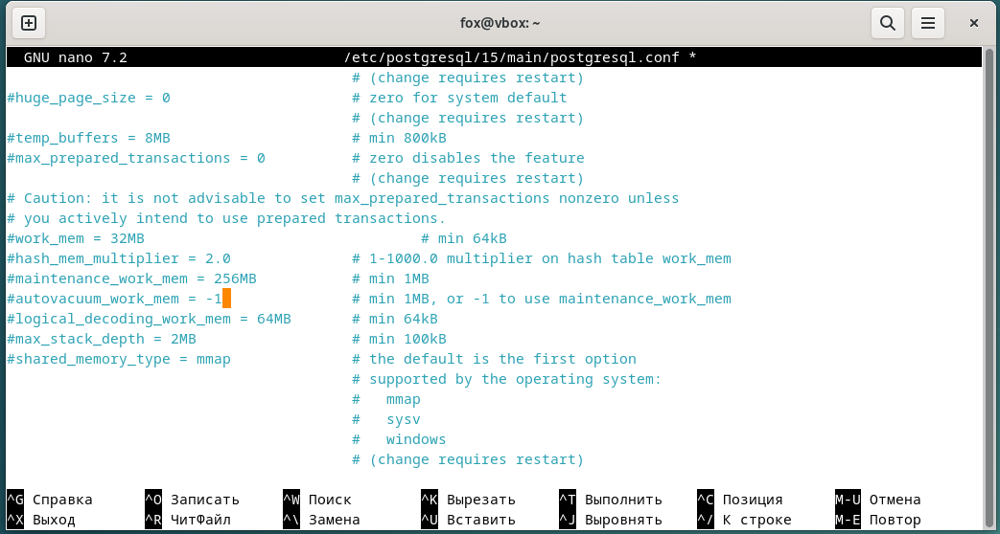

- effective_cache_size — оценочный параметр, указывающий планировщику запросов объём памяти, доступной для кэширования данных операционной системой и самим PostgreSQL. Влияет на выбор плана выполнения запроса (например, использование индекса или последовательное сканирование). Изменение параметра effective_cache_size представлен на рисунке ниже

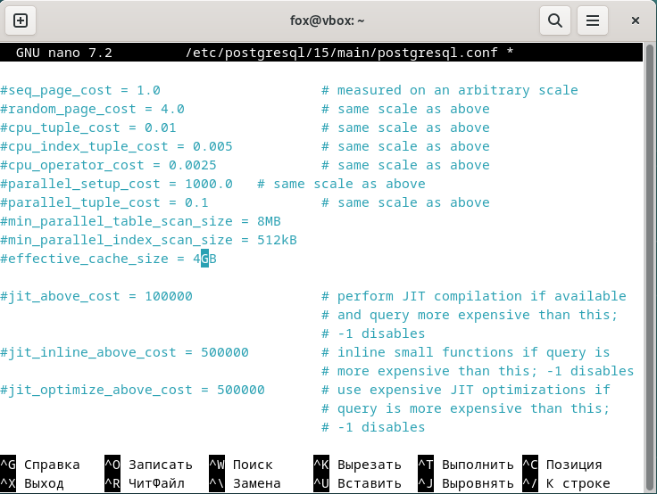

После чего были выполнены команды перезапуска службы PostgreSQL: 

```
sudo systemctl restart postgresql
```

Выполнена проверка статуса. 

```
sudo systemctl status postgresql
```

Результат представлен на рисунке ниже

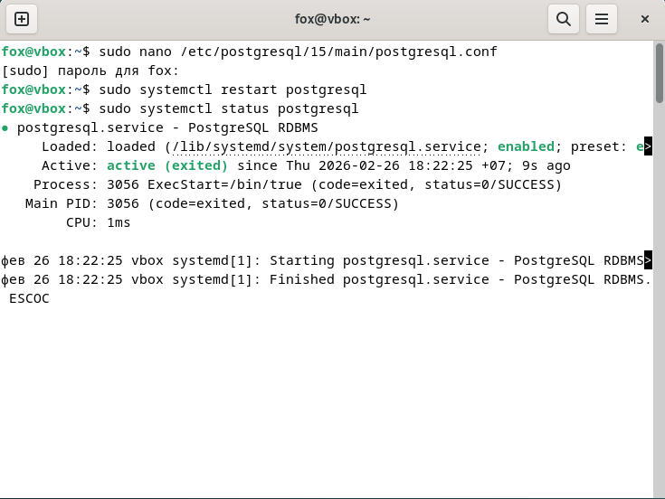

Команда SHOW shared_buffers; используется для просмотра текущего значения параметра shared_buffers. Этот параметр определяет объём общей буферной памяти PostgreSQL, применяемой для кеширования данных и ускорения работы с таблицами и индексами. Процесс выполнения команды представлен на рисунке ниже

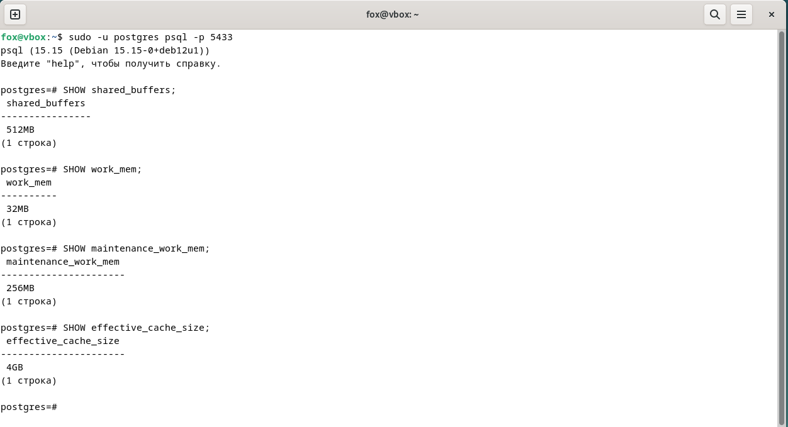

---

## 2. Индексы и анализ
Для оценки влияния индексов на производительность запросов была использована таблица public.people, содержащая информацию о пользователях. Для тестирования в таблицу было добавлено 200 000 строк с помощью функции generate_series. Каждая запись содержит поле fullname текстовое и age численное.

```
INSERT INTO public.people (fullname, age)
SELECT 'Person ' || gs,
       (random()*80)::int + 1
FROM generate_series(1, 200000) gs;

SELECT count(*) FROM public.people;
```

С помощью команд EXPLAIN и EXPLAIN ANALYZE получен план выполнения запроса до создания индекса. Результат выполнения представлен на рисунке ниже.  Процесс наполнения таблицы представлен на рисунке ниже.

```
EXPLAIN ANALYZE
SELECT * FROM public.people WHERE age = 30;
```

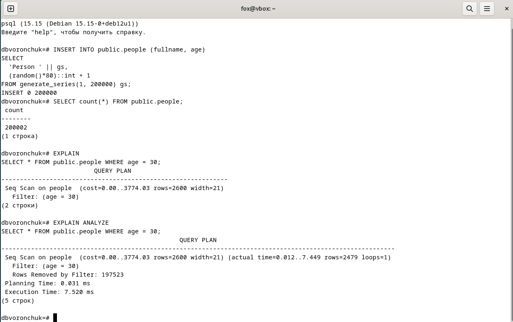


- Для ускорения поиска по возрасту создан индекс на столбце age. Команда создания индекса представлена на рисунке ниже.

```
CREATE INDEX idx_people_age ON public.people(age);
```


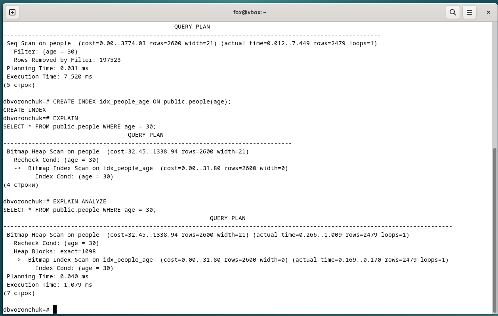

После создания индекса idx_people_age PostgreSQL перестал выполнять последовательное сканирование всей таблицы и начал использовать индекс. В результате время выполнения запроса уменьшилось примерно в 7 раз.

---

## 3. Хранимая функция

Я создал функцию если age < 0 → ничего не вставляет, возвращает сообщение об ошибке иначе вставляет строку в public.people и возвращает «Запись добавлена»

```
CREATE OR REPLACE FUNCTION public.add_person_checked(p_fullname text, p_age int)
RETURNS text
LANGUAGE plpgsql
AS $$
BEGIN
  IF p_age < 0 THEN
    RETURN 'Ошибка: отрицательное значение';
  END IF;

  INSERT INTO public.people(fullname, age)
  VALUES (p_fullname, p_age);

  RETURN 'Запись добавлена';
END;
$$;
```

- Пример создания функции и применения представлен на рисунке ниже:

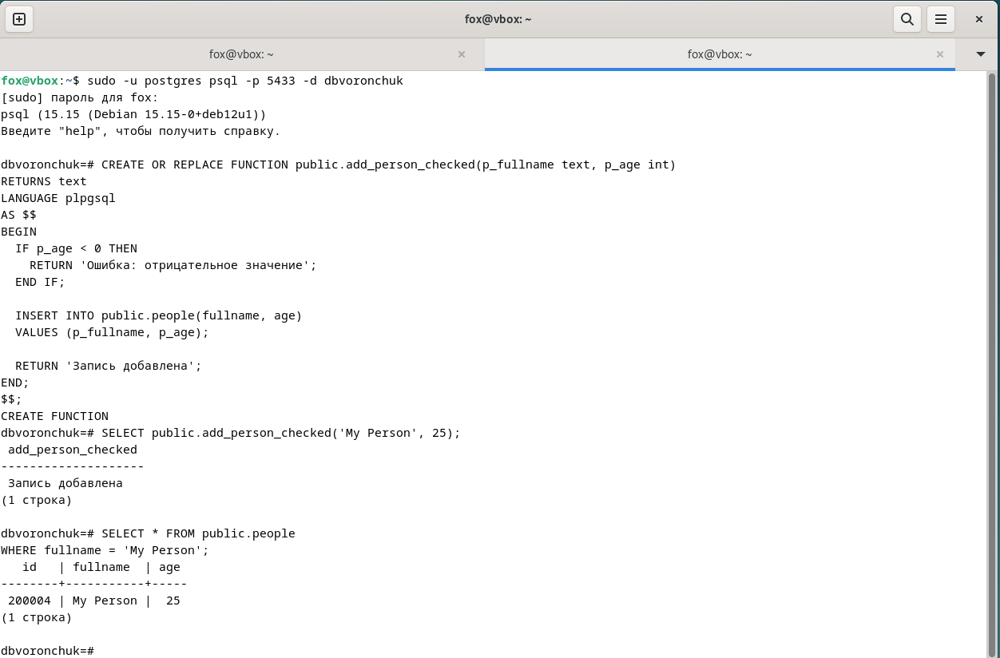

- Обработка ошибочного значения и проверка отсутствия записи показаны на рисунке ниже

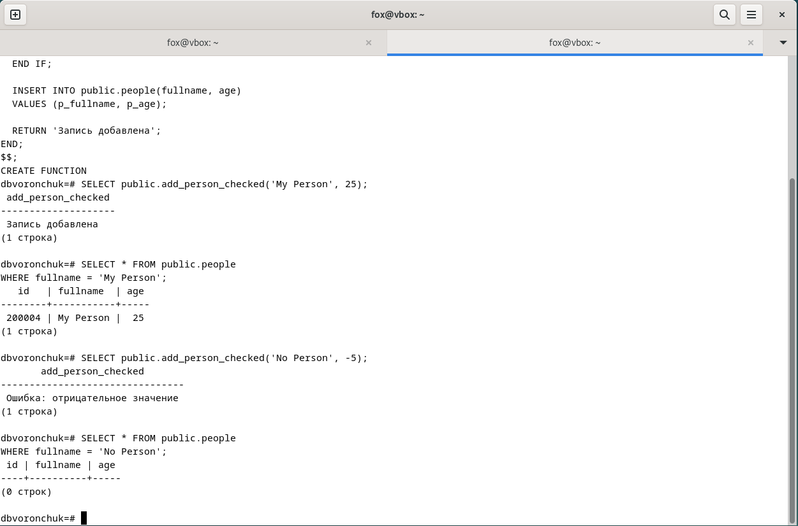

---

## 4. Триггер

- Создана триггерная функция check_product_price(), проверяющая значение поля price. Если значение отрицательное, вызывается RAISE EXCEPTION, что приводит к отмене операции вставки или обновления. Для таблицы test_schema.products создан триггер BEFORE INSERT OR UPDATE.  При попытке вставки записи с отрицательной ценой возникла ошибка, что подтверждает корректную работу триггера


```
CREATE OR REPLACE FUNCTION test_schema.check_product_price()
RETURNS trigger
LANGUAGE plpgsql
AS $$
BEGIN
  IF NEW.price < 0 THEN
    RAISE EXCEPTION 'Ошибка: цена не может быть отрицательной (price=%)', NEW.price;
  END IF;
  
  RETURN NEW;
END;
$$;
```

```
DROP TRIGGER IF EXISTS trg_check_product_price ON test_schema.products;

CREATE TRIGGER trg_check_product_price
BEFORE INSERT OR UPDATE ON test_schema.products
FOR EACH ROW
EXECUTE FUNCTION test_schema.check_product_price();
```
- Создание тригера  представлены на рисунке ниже

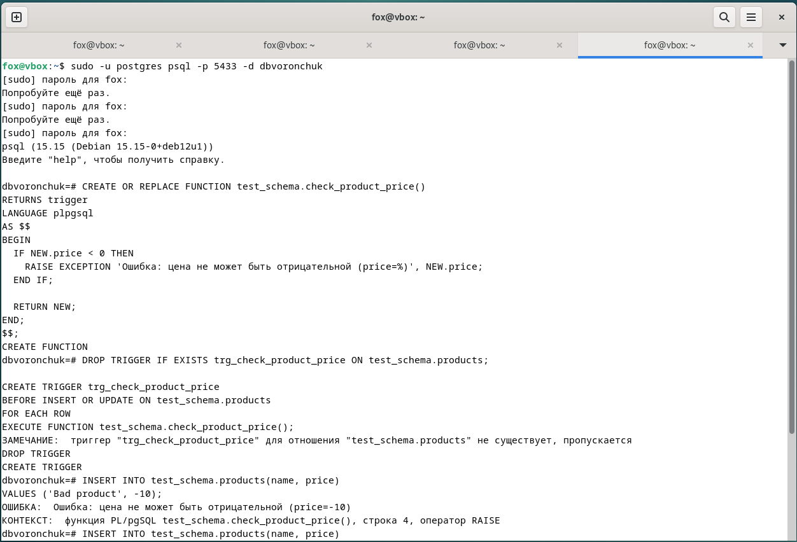

Обработка ошибочного значения и проверка отсутствия записи показаны на рисунке ниже:

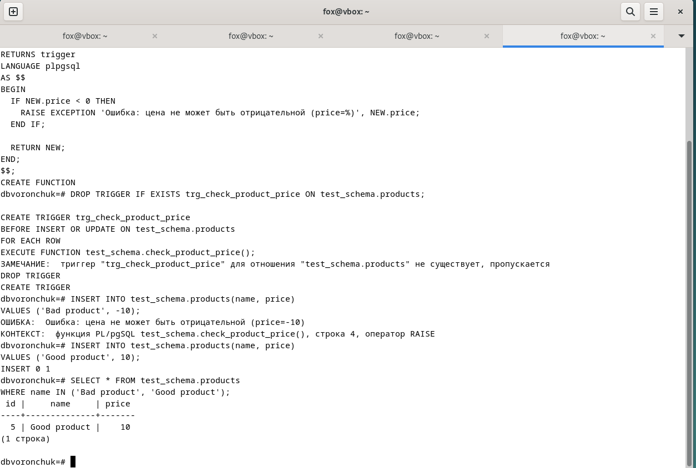

---

## 5. VACUUM и ANALYZE

- Я изучил параметры автовакуума, выполнил ручную очистку таблиц и проанализировал статистику использования таблиц и индексов.

Проверка включение автовакума

```
SHOW autovacuum;
```

Просмотр основных параметров автовакуума:

```
SHOW autovacuum_naptime;
SHOW autovacuum_vacuum_scale_factor;
SHOW autovacuum_analyze_scale_factor;
SHOW autovacuum_vacuum_threshold;
SHOW autovacuum_analyze_threshold;
```
Пример просмотра параметров автовакуума представлен на рисунке ниже:

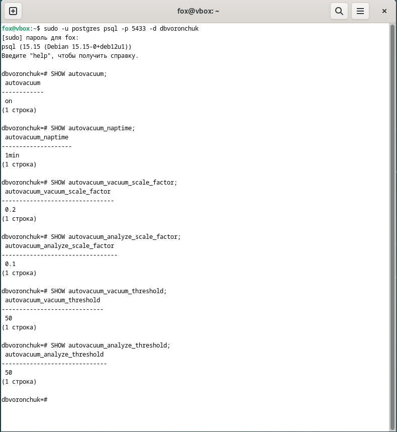

Для очистки мёртвых строк и обновления статистики я выполнил команду для таблицы public.people:

```
VACUUM (ANALYZE, VERBOSE) public.people;
```

VACUUM — очищает "мёртвые" версии строк, оставшиеся после операций UPDATE и DELETE, освобождая место для повторного использования и предотвращая раздувание таблиц

ANALYZE — собирает статистику распределения данных, которая помогает планировщику запросов выбирать оптимальные планы выполнения (Index Scan, Seq Scan и т.д.)

- Результат выполнения представлен на рисунке ниже

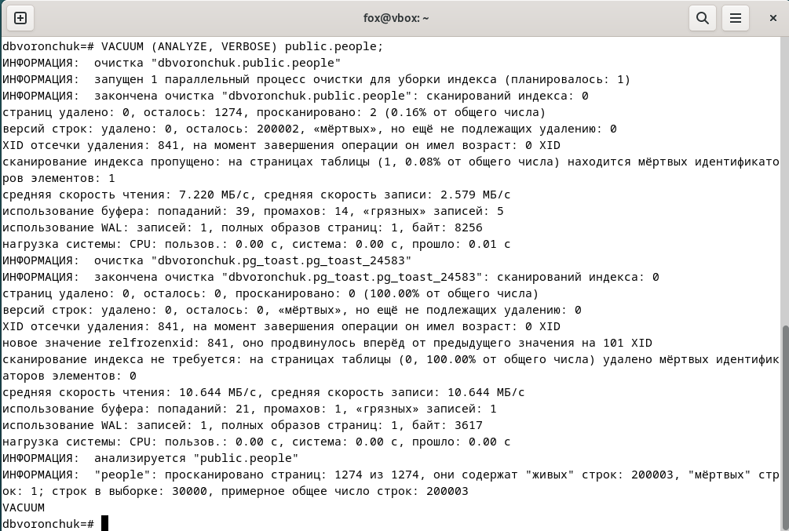

Для просмотра количества выполненных автовакуумов и ручных очисток я выполнил запрос:

```
SELECT schemaname, relname,
       n_live_tup, n_dead_tup,
       vacuum_count, autovacuum_count,
       analyze_count, autoanalyze_count,
       last_vacuum, last_autovacuum,
       last_analyze, last_autoanalyze
FROM pg_stat_user_tables
WHERE schemaname IN ('public','test_schema')
ORDER BY relname;
```

Статистика по таблицам представлена на рисунке ниже:

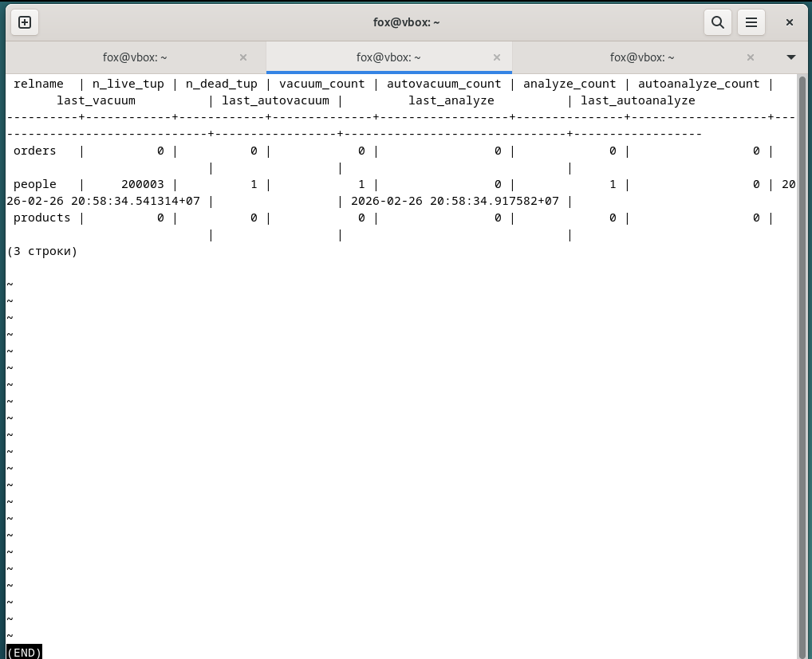

Для анализа использования индексов я выполнил запрос:

```
SELECT schemaname, relname, indexrelname,
       idx_scan, idx_tup_read, idx_tup_fetch
FROM pg_stat_all_indexes
WHERE relname = 'people'
ORDER BY idx_scan DESC;
```

Статистика использования индексов представлена на рисунке ниже:

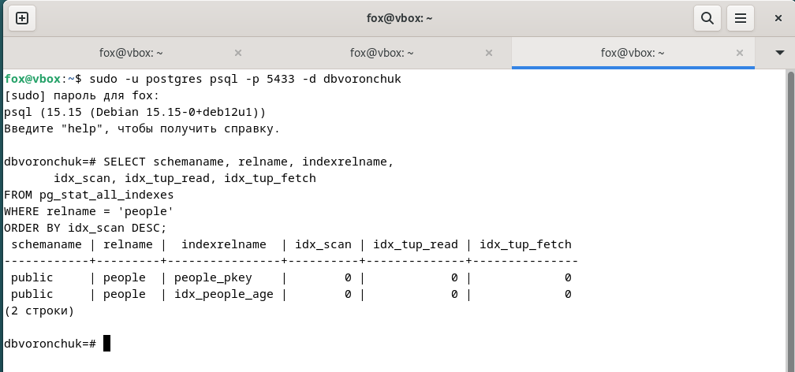
